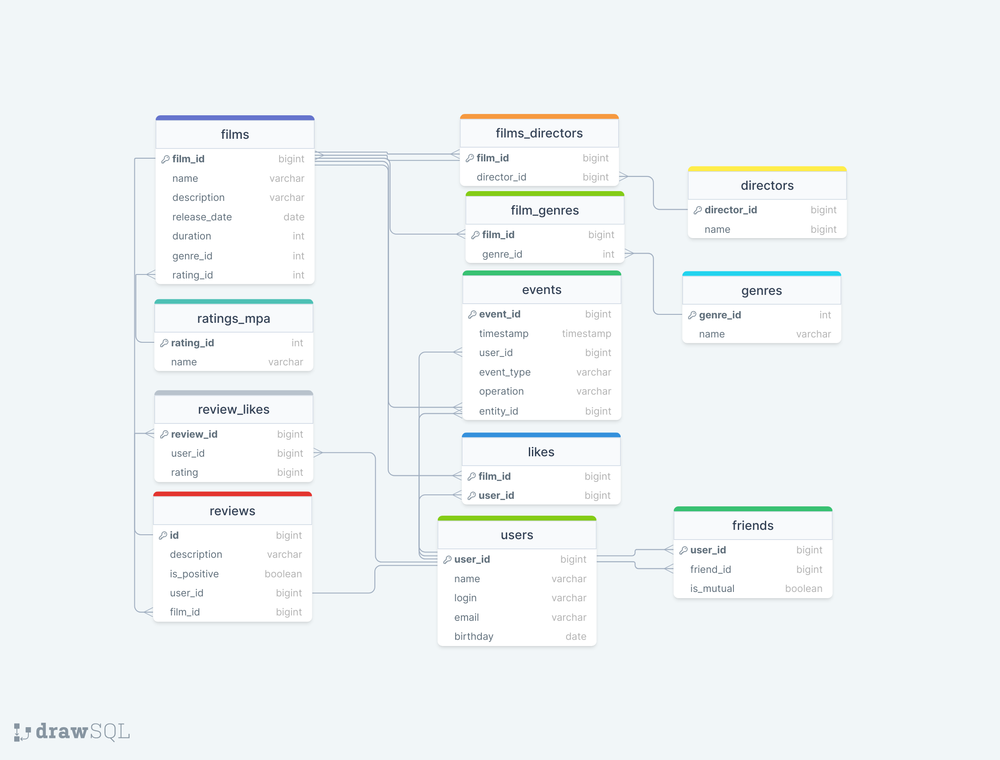

# Filmorate
> Это сервис для кинотеки,
> который дает возможность пользователям выбирать, 
> комментировать и оценивать любимые фильмы, 
> а также искать наиболее популярные среди них. 
> Кроме того, на сервисе можно добавлять друзей 
> и получать рекомендации на основе их лайков, просматривать список общих фильмов.
> Есть функция поиска по названию фильма и по режиссёру.

## Схема базы данных проекта

</details>

<details>
    <summary><h3>Описание схемы</h3></summary>
 * films - cодержит данные о фильмах
 * genres - cодержит данные о существующих жанрах
* film_genres - cодержит данные о жанре конкретного фильма
* ratings_mpa - cодержит данные о существующих рейтингах МРА
* likes - cодержит данные о том, какой пользователь какой фильм лайкнул
* users - cодержит данные о пользователях
* friends - cодержит данные о взаимности дружбы
* reviews - cодержит данные об отзывах
* review_like - cодержит данные о лайках, поставленных на отзыв
* directors - cодержит данные о режиссерах
* films_directors - cодержит данные о режиссерах конкретного фильма
* events - cодержит данные ленты событий

## Примеры SQL запросов к БД:

</details>

<details>
    <summary><h3>Топ 5 самых популярных фильмов</h3></summary>
    
```SQL
SELECT
films.name
FROM films
WHERE film_id IN (SELECT film_id
                   FROM likes
                   GROUP BY film_id
                   ORDER BY COUNT(user_id) DESC
                   LIMIT 5);
``` 
</details>

<details>
    <summary><h3>Все жанры конкретного фильма</h3></summary>
    
```SQL
SELECT
f.genre_id,
g.name 
FROM film_genres AS f 
LEFT OUTER JOIN genres AS g ON f.genre_id = g.genre_id 
WHERE f.film_id=%d 
ORDER BY g.genre_id;
```
</details>

<details>
    <summary><h3>Возвращает фильм по ид</h3></summary>
    
```SQL
SELECT f.film_id,
       f.name,
       f.description,
       f.release_date,
       f.duration,
       mp.name AS mpa_rating,
       g.name  AS genre
FROM films f
         JOIN ratings_mpa mp ON f.rating_id = mp.rating_id
         JOIN film_genres fg ON f.film_id = fg.film_id
         JOIN genres g ON fg.genre_id = g.genre_id
WHERE f.film_id = ?;
```
